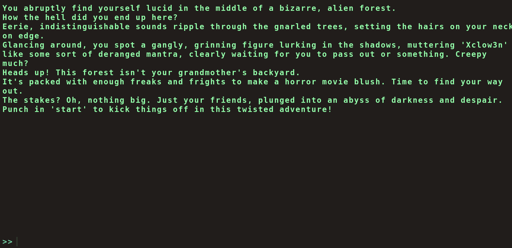
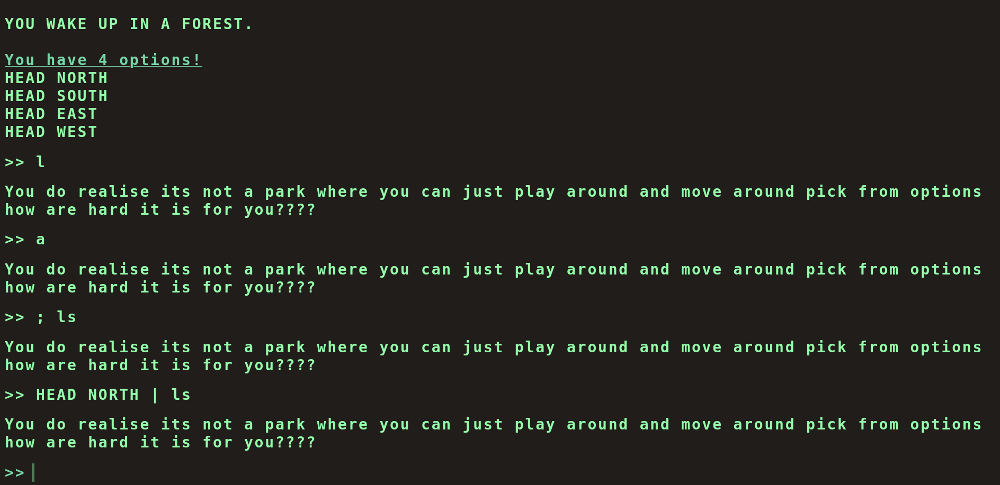
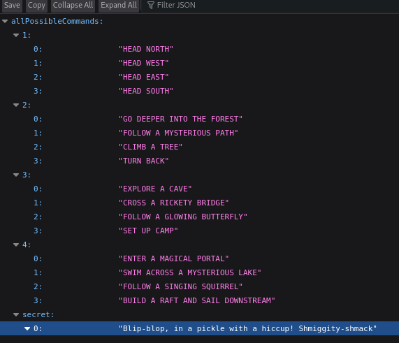

> Short and fun CTF that reminded me of an important rule: **always check the source code**.

---

## The Setup

When I visited the challenge website, I was greeted with a bunch of text and what looked like a "command prompt" interface.



It turned out to be a story-based game, where we can only type specific commands to proceed. If you try anything else, the game responds with some sarcastic remarks:



It tells you to type `help`, and gives you only a few commands like:

- `start`
- `clear`
- `audio`
- `restart`
- `info`

---

## My Initial Thoughts

At first, I thought I needed to **exploit the machine** somehow — maybe break out of the prompt or inject something. I was in that classic "how do I break this?" hacker mindset.
But then I realized… this felt more like a puzzle, not a box to pwn.

No tools needed. Just **observation and patience**.

So I took a step back and thought: *"What's really going on in the background?"*

---

## Source Code Inspection

So, I popped open the **DevTools** and checked the page source. That's when I found this:

```html
<script type="module">
    import { startCommander, enterKey, userTextInput } from "/static/terminal/js/main.js";
</script>
```

This main.js file looked promising. Digging into it, I saw something interesting:

```js
if (availableOptions[currentStep].includes(currentCommand) || availableOptions['secret'].includes(currentCommand)) {
```

There's a secret command list??

---

## Discovering the API

Looking further into how options are fetched, I noticed an internal API endpoint at: `/options/api`

Visiting it revealed… a secret command tied to pickle rick. Again with this guy.


---

## Solution

Typing the secret command gave me the flag instantly.

---

## What I Learned

This was a great warm-up CTF and a reminder that:

- Not every box needs to be "exploited"
- Sometimes the answer is in the source code, just waiting to be read
- DevTools and JS files can be goldmines

CTFs like this teach you to look before you leap. And honestly, I needed that reset.

**If you're trying this room too and get stuck, feel free to DM me or just throw commands at the wall like I did — eventually something sticks.**
