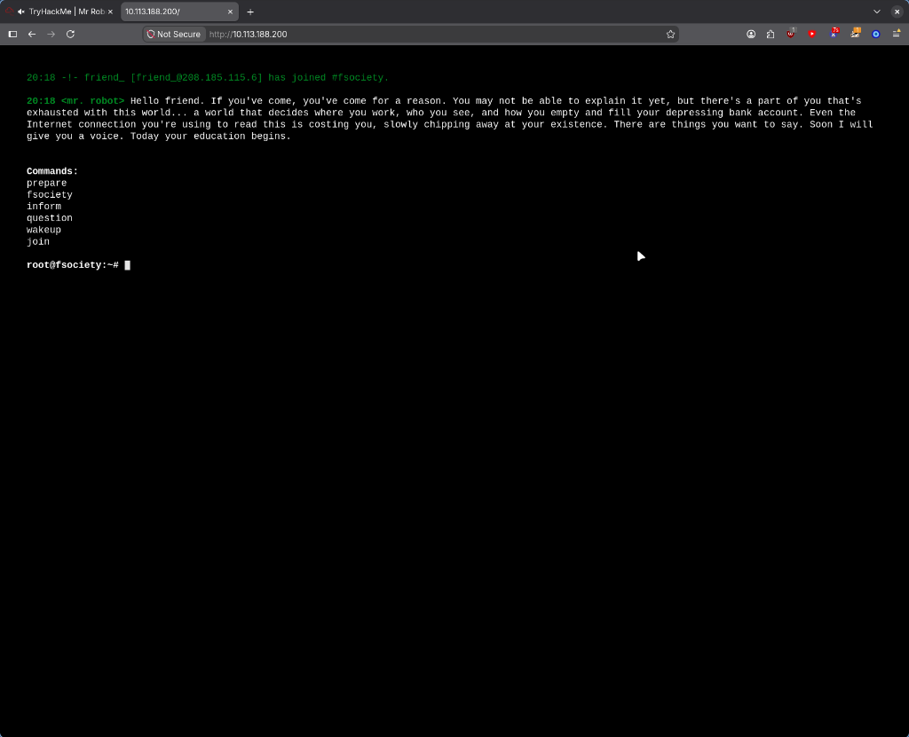
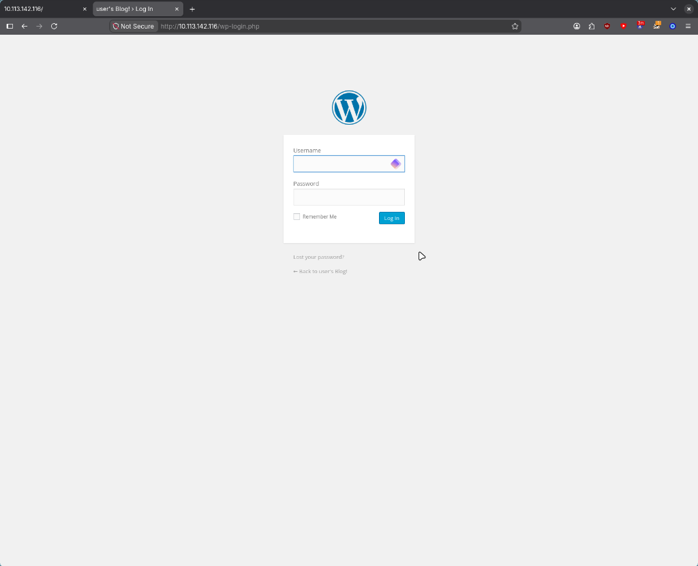
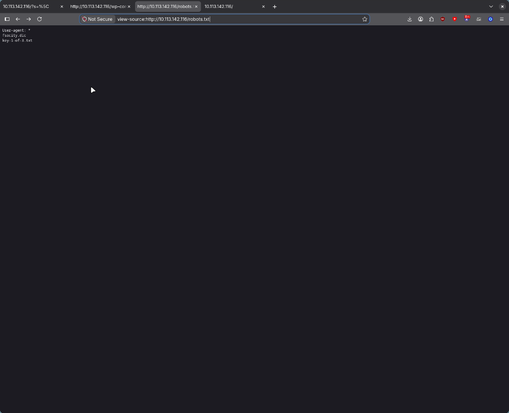
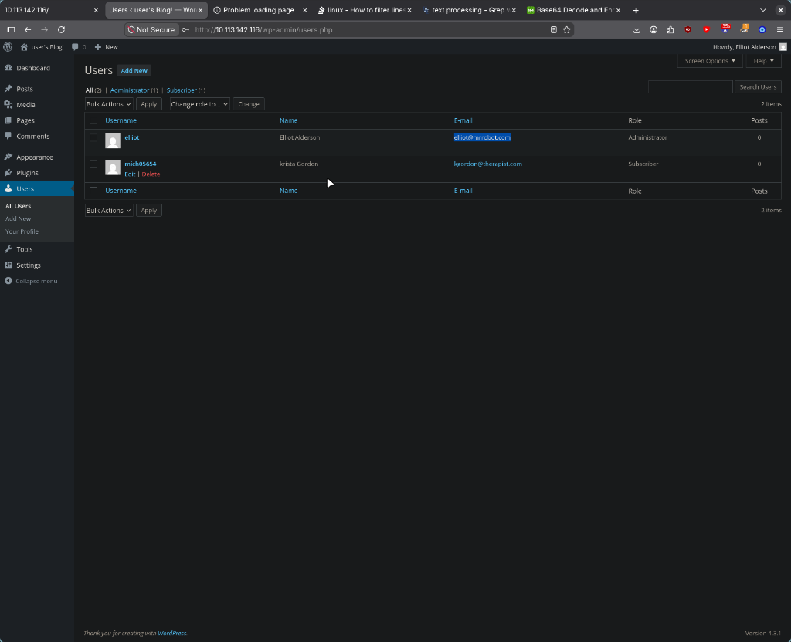

# Mr Robot - TryHackMe CTF

Based on the Mr. Robot show, and honestly one of the most fun rooms I've done so far. Three hidden keys on the box, and I found every single one of them the hard way — including a few rabbit holes that cost me time. This is the recap.
Note: like always, I'm leaving the actual keys/flags out of this writeup so I don't spoil the room for anyone.
[Link for the CTF](https://tryhackme.com/room/mrrobot)

---

## First Contact

Deployed the box and did my usual ping check. Interesting detail: ping showed packets coming back, but nmap reported the host as filtered with all 1000 ports showing `no-response`. I had to use `-Pn` and even then the box needed time — the scan took over 200 seconds while the machine was still booting its services. Lesson learned: don't trust the first scan against a fresh VM.

Opening the website in the browser, I got greeted with a **terminal-like interactive interface**:


## Source Code Rabbit Holes

My first thought was "deobfuscation" when I saw a `s_code.js` file in the source. Spoiler: it was just a standard minified Adobe Analytics vendor library. Nothing to see there.

I also found a weird script with `data-protonpass-role` in it... which turned out to be injected by my own **Proton Pass browser extension**. Important lesson: audit what's actually served by the target vs what your own browser injects.

But one thing in the source was real: a link to a login page at `/wp-login.php`:


That means **WordPress**. High-value attack surface.

## robots.txt (Again!)

After being a bit lost, I checked `robots.txt` — and it paid off immediately:


Two entries:

- `fsocity.dic` — a huge custom wordlist (remember this one)
- `key-1-of-3.txt` — first key, sitting right there

## The Wordlist and the licence(l) Typo

I poked around `fsocity.dic` for a while. I was convinced there was an email in there — sorted it, filtered characters, found nothing. No `@` at all. So I pivoted to directory enumeration with **gobuster** using the dic as wordlist:

```text
zero ❯ gobuster dir --wordlist=fsec.dic --url http://<machine-ip>
license              (Status: 200) [Size: 309]
login                (Status: 302) [--> /wp-login.php]
readme               (Status: 200) [Size: 64]
admin                (Status: 301) [--> /admin/]
...
```

Two funny moments here:

- I first tried `/licence` — the UK spelling — and got a WordPress 404. The room literally punishes spelling.
- `/readme` just told me: *"I like where your head is at. However I'm not going to help you."* Rude.

`/license` returned a quote from the show... but viewing the raw source revealed more text that the browser hid behind a **Content Encoding Error**. Curling the page directly showed the full output, including a suspicious base64 string at the end.

I threw it into a base64 decoder and out came a WordPress credential pair. (Not printing it here — try the room.) Logged into `/wp-admin/` and I was in as an **Administrator**:


There was even a second user account (a Subscriber). I spent some time trying to log in as them with a password I created for fun — nope, nothing. Dead end, moved on.

## Theme Editor Reverse Shell

With admin rights on WordPress, the classic move: **Appearance -> Theme Editor**, and injected a PHP reverse shell into the Twenty Fifteen theme's `404.php` template. Then triggering any 404 on the site executes it — shell as the `daemon` user.

From there I enumerated `/home/robot/` and found:

- `key-2-of-3.txt` — readable only by `robot`, of course
- `password.raw-md5` — an MD5 hash, very subtle

Cracked the hash with **John the Ripper** (`--format=raw-md5` + rockyou), `su robot`, and the second key was mine.

## Root via SUID Nmap

For the last key I went hunting for SUID binaries:

```text
$ find / -user root -perm /4000 2>/dev/null
/usr/local/bin/nmap
...
```

Wait — nmap as SUID? That's an ancient version (3.81), and old nmap has an **interactive mode** with a shell escape:

```text
$ /usr/local/bin/nmap --interactive

Starting nmap V. 3.81 ( insecure-scripting mode )
nmap> !sh
root@<machine-ip>:~# cat /root/key-3-of-3.txt
```

Root. Third key in hand, room complete.

## What I Learned

- `robots.txt` is still the highest value free check on any web target
- Distinguish **target-served** code from **browser-extension-injected** noise before going down a deobfuscation rabbit hole
- UK vs US spelling can literally hide a page from you (`licence` vs `license`)
- When the browser chokes on a response (**Content Encoding Error**), `curl` the raw page anyway
- WordPress admin = RCE via the theme editor, almost always
- Legacy SUID binaries are a gift — check GTFOBins

---

**If you're trying this room too and get stuck, feel free to DM me or just throw commands at the wall like I did — eventually something sticks.**
